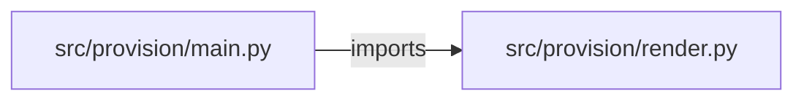

# infra-provisioning-api — project architecture

[README](README.md) · [Interview questions and answers](INTERVIEW_QA.md)

## Purpose and scope

`POST /stacks` validates a request and returns three Terraform files: `main.tf` calling `terraform/modules/service`, `variables.tf`, and `terraform.tfvars`. It also returns a monthly estimate for the chosen size. `applied` is false. Nothing here runs `terraform apply`, and GCP credentials are not read. The next step is a pull request.

This document describes files and symbols in this checkout. Deployment templates and statements in the original overview are distinguished from a verified running environment.

## Component diagram



For Python repositories, arrows show resolved local imports, not network calls or deployment order. Otherwise the diagram is a repository component map; containment arrows do not assert runtime integration.

## Components and responsibilities

| Component | Responsibility |
| --- | --- |
| [`src/provision/main.py`](src/provision/main.py) | HTTP handlers: `GET /healthz`, `GET /options`, `POST /stacks` |
| [`src/provision/render.py`](src/provision/render.py) | Functions: `validate`, `render` |
| [`requirements.txt`](requirements.txt) | Implementation or supporting configuration |
| [`terraform/modules/service/main.tf`](terraform/modules/service/main.tf) | Terraform resource/module declarations |
| [`tests/test_provision.py`](tests/test_provision.py) | Executable checks and regression examples |
| [`.github/workflows/ci.yml`](.github/workflows/ci.yml) | GitHub Actions job definitions |
| [`README.md`](README.md) | Project explanations or operating notes |

## Request interface

| Method and path | Handler | Source |
| --- | --- | --- |
| `GET /healthz` | `healthz` | [`src/provision/main.py`](src/provision/main.py#L19) |
| `GET /options` | `options` | [`src/provision/main.py`](src/provision/main.py#L24) |
| `POST /stacks` | `create_stack` | [`src/provision/main.py`](src/provision/main.py#L29) |

The table lists literal route decorators found in the inspected Python modules. Router prefixes and middleware can add behavior; check the linked handler and application setup before calling an endpoint.

## Implementation walkthrough

### `render(request)`

Source: [`src/provision/render.py`](src/provision/render.py#L39).

Calls visible in this function: `validate`.

```python
def render(request):
    validate(request)
    size = SIZES[request["size"]]
    main = (
        'module "service" {\n'
        '  source       = "../../modules/service"\n'
        "  name         = var.name\n"
        "  environment  = var.environment\n"
        "  region       = var.region\n"
        "  machine_type = var.machine_type\n"
        "  labels       = var.labels\n"
        "}\n"
    )
    variables = (
        'variable "name" { type = string }\n'
        'variable "environment" { type = string }\n'
        'variable "region" { type = string }\n'
        'variable "machine_type" { type = string }\n'
        'variable "labels" { type = map(string) }\n'
    )
    tfvars = (
        f'name         = "{request["name"]}"\n'
```

The excerpt is truncated; the linked source contains the full implementation.

### `validate(request)`

Source: [`src/provision/render.py`](src/provision/render.py#L20).

Calls visible in this function: `', '.join`, `LABEL.fullmatch`, `NAME.fullmatch`, `ORDER.index`, `RenderError`, `request.get`.

```python
def validate(request):
    if request["environment"] in {"prod", "production"}:
        raise RenderError("prod is not rendered; change the GitOps repository")
    if request["environment"] not in ENVIRONMENTS:
        raise RenderError("environment must be dev or staging")
    if not NAME.fullmatch(request["name"]):
        raise RenderError("name must be 3 to 30 lowercase letters, digits, or dashes, starting with a letter")
    if request["region"] not in REGIONS:
        raise RenderError(f"region must be one of {', '.join(REGIONS)}")
    if request["size"] not in SIZES:
        raise RenderError("size must be small, medium, or large")
    cap = SIZE_CAP[request["environment"]]
    if ORDER.index(request["size"]) > ORDER.index(cap):
        raise RenderError(f"{request['environment']} is capped at {cap}")
    for key in ("team", "cost_center"):
        if not LABEL.fullmatch(request.get(key) or ""):
            raise RenderError(f"{key} label is required: lowercase letters, digits, dashes, underscores")
```

## Validation and failure paths

| Explicit exception | Source |
| --- | --- |
| `HTTPException(status_code=422, detail=str(exc))` | [`src/provision/main.py`](src/provision/main.py#L33) |
| `RenderError('prod is not rendered; change the GitOps repository')` | [`src/provision/render.py`](src/provision/render.py#L22) |
| `RenderError('environment must be dev or staging')` | [`src/provision/render.py`](src/provision/render.py#L24) |
| `RenderError('name must be 3 to 30 lowercase letters, digits, or dashes, starting with a letter')` | [`src/provision/render.py`](src/provision/render.py#L26) |
| `RenderError(f"region must be one of {', '.join(REGIONS)}")` | [`src/provision/render.py`](src/provision/render.py#L28) |
| `RenderError('size must be small, medium, or large')` | [`src/provision/render.py`](src/provision/render.py#L30) |
| `RenderError(f"{request['environment']} is capped at {cap}")` | [`src/provision/render.py`](src/provision/render.py#L33) |
| `RenderError(f'{key} label is required: lowercase letters, digits, dashes, underscores')` | [`src/provision/render.py`](src/provision/render.py#L36) |

These are explicit exceptions in the inspected source, rather than a claim that every failure is handled. Follow the calling handler to see whether the exception becomes an HTTP response or propagates.

## Data and state

- [`src/provision/render.py`](src/provision/render.py) defines module-level containers: `SIZES`, `SIZE_CAP`.

Module-level dictionaries/lists live in a Python process. They can be fixtures or mutable state; inspect writes before treating them as persistent storage. A production extension would need to define persistence and concurrency behavior explicitly.

## Data flow and design decisions

### What is the input-to-output contract of `render`

In [`src/provision/render.py`](src/provision/render.py#L39), `render(request)` receives the inputs. The function computes these intermediate values:

- `size = SIZES[request['size']]`
- `main = 'module "service" {\n  source       = "../../modules/service"\n  name         = var.name\n  environment  = var.environment\n  region       = var.region\n  machine_type = var.machine_type\n  labels       = var.labels\n}\n'`
- `variables = 'variable "name" { type = string }\nvariable "environment" { type = string }\nvariable "region" { type = string }\nvariable "machine_type" { type = string }\nvariable "labels" { type = map(string) }\n'`
- `tfvars = f'''name         = "{request['name']}"\nenvironment  = "{request['environment']}"\nregion       = "{request['region']}"\nmachine_type = "{size['machine_type']}"\nlabels = {{\n  team        = "{request['team']}"\n  cost_center = "{request['cost_center']}"\n  environment = "{request['environment']}"\n  managed_by  = "provisioning-api"\n}}\n'''`

Its result is defined by:

- `{'applied': False, 'estimate': {'machine_type': size['machine_type'], 'monthly_usd': size['monthly_usd']}, 'files': {'main.tf': main, 'variables.tf': variables, 'terraform.tfvars': tfvars}, 'next_step': 'Open a pull request with these files. A reviewed pipeline runs terraform plan and apply.'}`

## Setup and verification

The following commands are derived from the checked-in dependency/test contracts. Execute them from the repository root; the block prepares a local environment, not a cloud deployment.

```bash
python3 -m venv .venv
source .venv/bin/activate
python -m pip install -r requirements.txt
python -m pytest -q
```

Python dependencies: [`requirements.txt`](requirements.txt).

Test entry points: [`tests/test_provision.py`](tests/test_provision.py).

Automation definitions: [`.github/workflows/ci.yml`](.github/workflows/ci.yml). Read their triggers and job steps to determine what CI actually runs.

## Operating boundaries and design review

Before turning this checkout into a customer deployment, establish the input contract, data ownership, access controls, failure response, evaluation criteria, and rollback owner. Repository fixtures and unit tests demonstrate local behavior; they do not establish throughput, uptime, compliance, or business impact.

A useful architecture review starts with the linked implementation: identify where input enters, where a decision is made, which state can change, and which external dependency can fail. Add a deployment view only for infrastructure that is actually configured and exercised.
